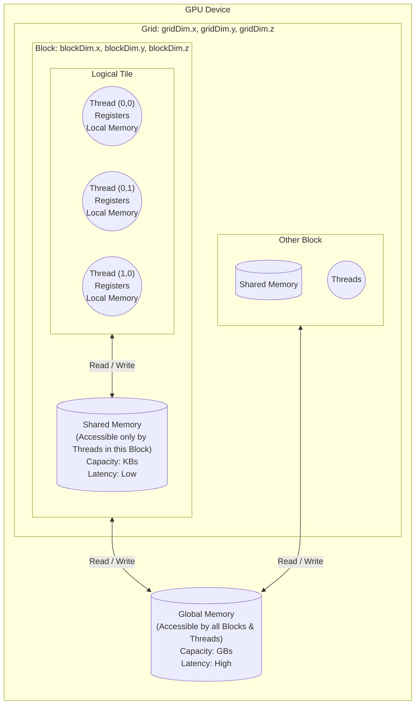
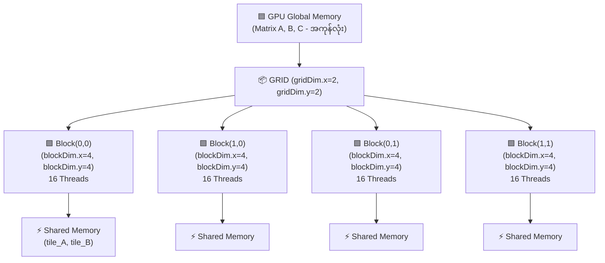
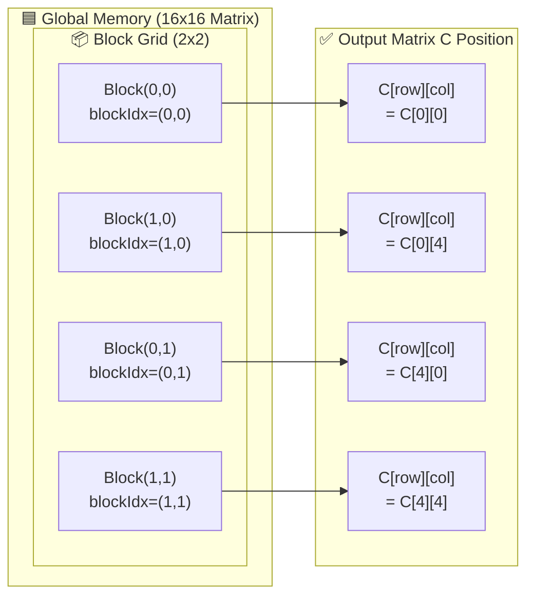
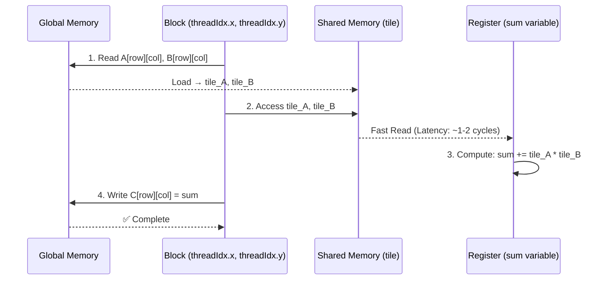

# CUDA Thread, Block, Tile and Memory Hierarchy



### ရှင်းလင်းချက်-
1. **Global Memory:**
   - **တည်နေရာ:** GPU ရဲ့ VRAM (Video RAM) ပေါ်မှာ ရှိပါတယ်။
   - **Dimension / Access:** Grid ထဲက ဘယ် Block, ဘယ် Thread မဆို လှမ်းသုံးလို့ရပါတယ်။ Storage အများဆုံးဖြစ်ပေမယ့် Latency အမြင့်ဆုံး ဖြစ်ပါတယ်။

2. **Grid & Block:**
   - **Grid Dimension:** `gridDim.x, gridDim.y, gridDim.z` ဆိုပြီး 1D, 2D, 3D အနေနဲ့ သတ်မှတ်လို့ရပါတယ်။
   - **Block Dimension:** `blockDim.x, blockDim.y, blockDim.z` ဆိုပြီး 1D, 2D, 3D အနေနဲ့ ထပ်ခွဲထားပါတယ်။
   - Grid တစ်ခုထဲမှာ Block ပေါင်းများစွာ ပါဝင်ပါတယ်။

3. **Shared Memory:**
   - **တည်နေရာ:** GPU ရဲ့ Streaming Multiprocessor (SM) ပေါ်မှာ on-chip အနေနဲ့ ရှိပါတယ်။
   - **Dimension / Access:** သက်ဆိုင်ရာ **Block တစ်ခုတည်း** မှာရှိတဲ့ Thread တွေပဲ မျှဝေသုံးစွဲလို့ရပါတယ်။ Global Memory ထက် အများကြီး ပိုမြန်ပါတယ်။

4. **Tile:**
   - Matrix Multiplication လိုမျိုး Algorithm တွေရေးတဲ့အခါ Block ကြီးတစ်ခုလုံးကို Sub-matrix (ဥပမာ 16x16, 32x32) အပိုင်းလေးတွေ Logical ထပ်ခွဲတာကို ခေါ်တာဖြစ်ပါတယ်။ (Hardware အရ သီးသန့်မရှိပါဘူး၊ Shared Memory ကို ထိရောက်စွာသုံးနိုင်ဖို့ Software ပိုင်းကနေ Logical ခွဲခြားတဲ့ သဘောတရားပါ။)

5. **Thread:**
   - **တည်နေရာ:** အသေးဆုံး execution unit ဖြစ်ပါတယ်။
   - **Memory:** Thread တစ်ခုချင်းစီမှာ ကိုယ်ပိုင်အသုံးပြုဖို့ **Registers** တွေနဲ့ **Local Memory** တွေ ပါရှိပါတယ်။ ယင်းတို့ကို အခြား thread တွေက လှမ်းယူကြည့်လို့ မရပါဘူး။

---

## Tile-based Matrix Multiplication အဆင့်ဆင့် ရှင်းလင်းချက်

### ၁. Cubic Block တွေနဲ့ Grid Structure

Matrix Multiplication အတွက် 2D Grid နဲ့ 2D Block တွေသုံးပါတယ်။ အောက်ကဒီ diagram မှာ အုပ်စုတွေ ကွဲခြားတဲ့ပုံကို ကြည့်နိုင်ပါတယ်။



### ၂. Single Block အတွင်း Thread တွေ ဒီအတိုင်းစီချထားတဲ့ပုံ

```
TILE_SIZE = 4 ဆိုပြီး အဆုံးအဖြတ်ထားတဲ့အခါ:

  threadIdx.x →
  0   1   2   3
0 (0,0) (0,1) (0,2) (0,3)
1 (1,0) (1,1) (1,2) (1,3)  threadIdx.y
2 (2,0) (2,1) (2,2) (2,3)  ↓
3 (3,0) (3,1) (3,2) (3,3)

ဘယ်လို့ Block-level index မဟုတ်ပဲ threadIdx သုံးတာလဲ?
→ Block အတွင်း Thread တွေ အနေအထားကို ခွဲခြားတဲ့အတွက်
→ Shared Memory မှာ တစ်ခြား Thread တွေကို အခြန့်အသိုက် ကင်းမဲ့အောင်
```

### ၃. Row နဲ့ Column ကို Calculate ပုံ

အောက်က CUDA code မှာ:

```cuda
__global__ void mat_mul(float *A, float *B, float *C, int N) {
    __shared__ float tile_A[TILE_SIZE][TILE_SIZE];
    __shared__ float tile_B[TILE_SIZE][TILE_SIZE];

    int row = blockIdx.y * TILE_SIZE + threadIdx.y;
    int col = blockIdx.x * TILE_SIZE + threadIdx.x;
    float sum = 0.0f;
```

#### ၃.၁ Row Calculator

```
row = blockIdx.y * TILE_SIZE + threadIdx.y
     = Block တွေရဲ့ Row Position  +  Block အတွင်း Thread ရဲ့ Row
     
ဥပမာ:
  Block(0, 0): blockIdx.y = 0
    - Thread(0,0): row = 0*4 + 0 = 0 ✓
    - Thread(3,0): row = 0*4 + 3 = 3 ✓
    
  Block(1, 0): blockIdx.y = 1
    - Thread(0,0): row = 1*4 + 0 = 4 ✓
    - Thread(3,0): row = 1*4 + 3 = 7 ✓
```

#### ၃.၂ Column Calculator

```
col = blockIdx.x * TILE_SIZE + threadIdx.x
    = Block တွေရဲ့ Column Position  +  Block အတွင်း Thread ရဲ့ Column
    
ဥပမာ:
  Block(0, 0): blockIdx.x = 0
    - Thread(0,0): col = 0*4 + 0 = 0 ✓
    - Thread(0,3): col = 0*4 + 3 = 3 ✓
    
  Block(0, 1): blockIdx.x = 1
    - Thread(0,0): col = 1*4 + 0 = 4 ✓
    - Thread(0,3): col = 1*4 + 3 = 7 ✓
```

### ၄. Visual သုံးပြီး နားလည်ခွင့်



### ၅. Tile အယူအဆ မှန်ကန်သော နားလည်ခွင့်

```
TILE = Block အတွင်း Sub-matrix ရဲ့ အပိုင်းလေး

Shared Memory မှာ:
  __shared__ float tile_A[TILE_SIZE][TILE_SIZE];  // 4x4
  __shared__ float tile_B[TILE_SIZE][TILE_SIZE];  // 4x4

မြန်မြန် Memory Access အတွက် သုံးတဲ့အကြောင်း:
  
  1️⃣ Global Memory → Shared Memory သို့ Load
     tile_A[threadIdx.y][threadIdx.x] = A[row][col];
     tile_B[threadIdx.y][threadIdx.x] = B[row][col];
     
     (အကြီးကြီး Global Memory ကနေ အသေးအဆိုး Shared Tile ကို ယူတယ်)
     
  2️⃣ Shared Memory ရဲ့ Tile တွေ သုံးပြီး Calculate
     for(k) {
       sum += tile_A[threadIdx.y][k] * tile_B[k][threadIdx.x];
     }
     
     (မြန်တဲ့ Shared Memory ကနေ အလျင်အမြန် Read လုပ်တယ်)
     
  3️⃣ Shared Memory → Global Memory သို့ Write
     C[row][col] = sum;
```

### ၆. Block အားလုံး ပြည့်စုံတဲ့ အခြေအနေ - 16x16 Matrix

```
Grid (2x2 Blocks) × Block (4x4 Threads) = 8x8 Threads အုပ်စု
                                         = 8x8 Matrix ထုတ်ယူနိုင်

ဒါမှ 16x16 Matrix အတွက် လုံလောက်တယ်။

Kernel Invocation:
  dim3 grid(2, 2);        // gridDim = (2, 2)
  dim3 block(4, 4);       // blockDim = (4, 4)
  mat_mul<<<grid, block>>>(A, B, C, 16);
```

### ၇. လုပ်ငန်းတွင်း သက်သက် ပုံတစ်ခု



### အကျဉ်းချုပ် (Key Points)

| အစိတ်အခြာ | ရှင်းလင်းချက် |
|---------|----------|
| **blockIdx** | Block တွေ ကြီးကြီးအလိုက် အနေအထားကို သိနိုင်တယ် |
| **threadIdx** | Block အတွင်း Thread တစ်ခုချင်းစီ အနေအထားကို သိနိုင်တယ် |
| **Global Index** | `blockIdx * blockDim + threadIdx` ဖြင့် ယူတယ် |
| **Tile** | Shared Memory သုံးပြီး Fast Access လုပ်နိုင်ဖို့ အသုံးပြုတယ် |
| **Shared Memory** | Block အတွင်း Thread အားလုံး မျှဝေသုံးစွဲနိုင်တယ် |
