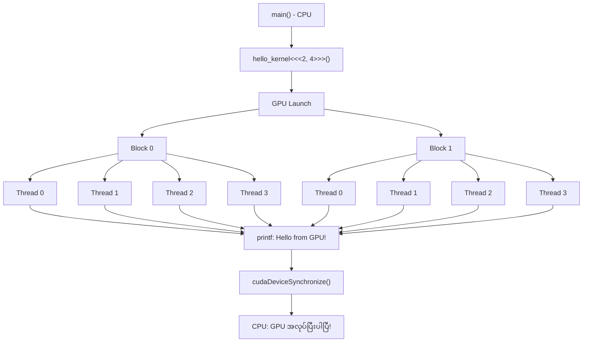
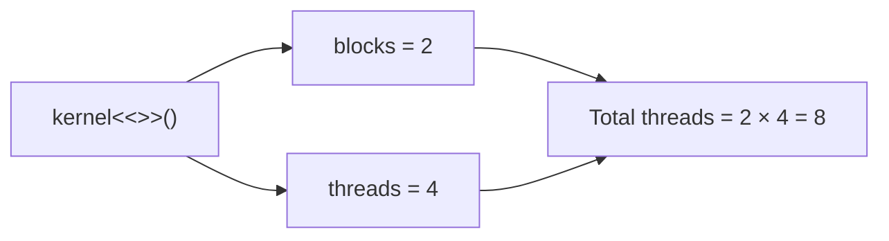
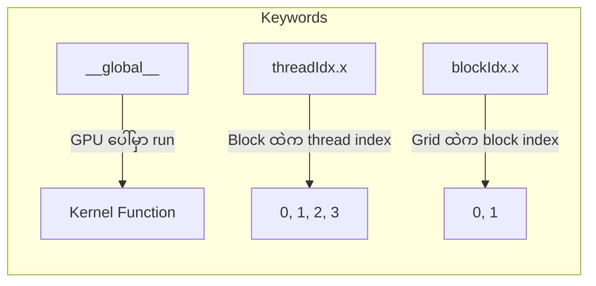

# Lesson 1: Hello CUDA

## Program Flow

## Kernel Launch Syntax

## Key Concepts

## Thread Indexing

| | Thread 0 | Thread 1 | Thread 2 | Thread 3 |
|---|---|---|---|---|
| **Block 0** | blockIdx=0, threadIdx=0 | blockIdx=0, threadIdx=1 | blockIdx=0, threadIdx=2 | blockIdx=0, threadIdx=3 |
| **Block 1** | blockIdx=1, threadIdx=0 | blockIdx=1, threadIdx=1 | blockIdx=1, threadIdx=2 | blockIdx=1, threadIdx=3 |
