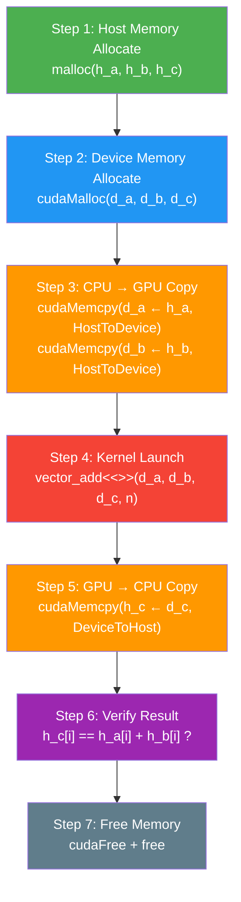
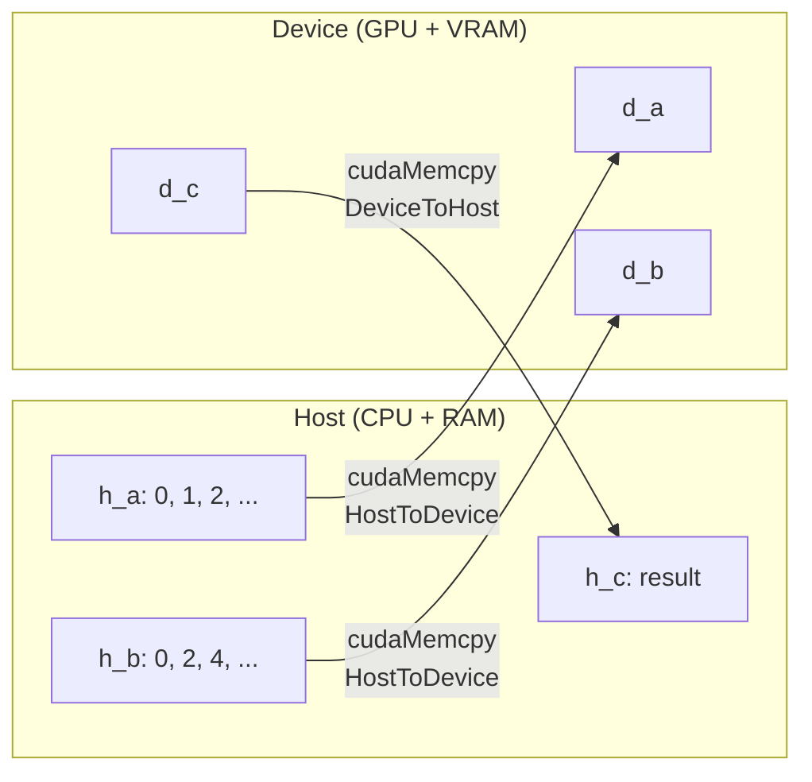
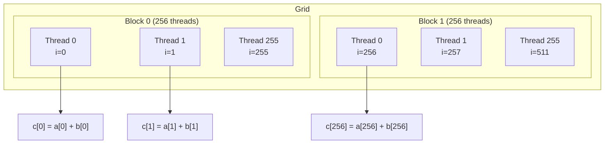
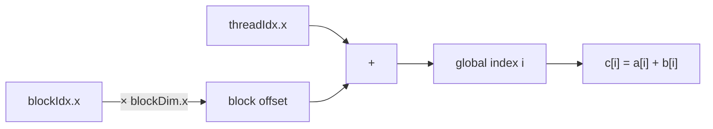

# Lesson 2: Vector Addition

## CUDA Program ၇ ဆင့် Flow

## Memory Layout

## Thread-to-Element Mapping

## Global Thread Index တွက်ပုံ

> `i = blockIdx.x * blockDim.x + threadIdx.x`
>
> Block 1, Thread 3: `i = 1 * 256 + 3 = 259`
