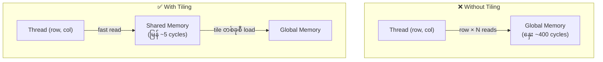
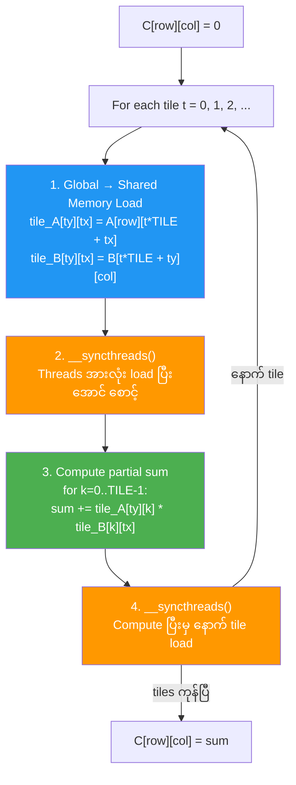
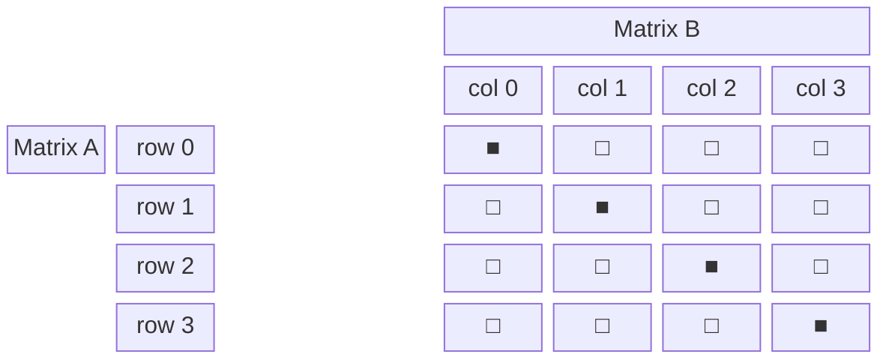
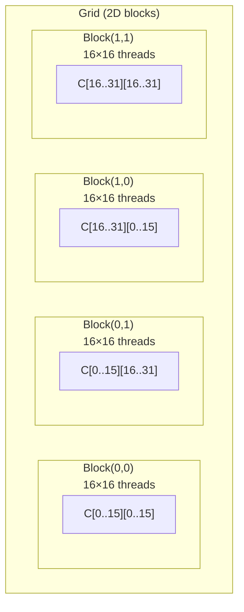

# Lesson 3: Tiled Matrix Multiplication

## Shared Memory ဘာလို့ သုံးလဲ

## Tiled Computation Flow

## Tile Loading Visualization (TILE_SIZE=4 ဥပမာ)

## 2D Grid/Block Configuration

## Memory Access Comparison

| | Global Memory Only | Tiled (Shared Memory) |
|---|---|---|
| **Global reads per element** | 2N | 2N / TILE_SIZE |
| **N=512, TILE=16** | 1024 reads | 64 reads |
| **Speedup** | 1× | **16×** |
