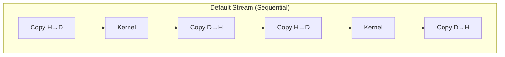
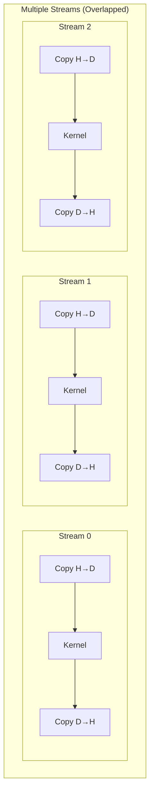
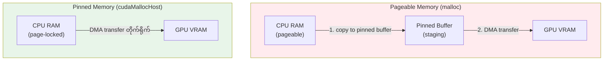
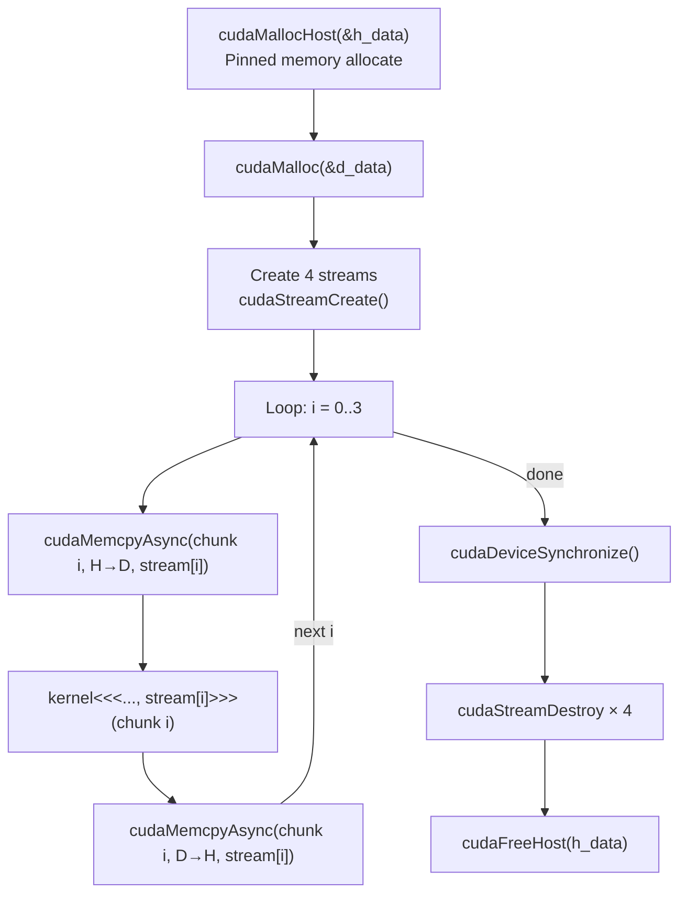

# Lesson 4: CUDA Streams

## Stream ဆိုတာ ဘာလဲ

## Timeline Overlap

```mermaid
gantt
    title CUDA Stream Overlap Timeline
    dateFormat X
    axisFormat %s

    section Stream 0
    Copy H→D   :s0c1, 0, 2
    Kernel      :s0k, 2, 5
    Copy D→H   :s0c2, 5, 7

    section Stream 1
    Copy H→D   :s1c1, 1, 3
    Kernel      :s1k, 3, 6
    Copy D→H   :s1c2, 6, 8

    section Stream 2
    Copy H→D   :s2c1, 2, 4
    Kernel      :s2k, 4, 7
    Copy D→H   :s2c2, 7, 9

    section Stream 3
    Copy H→D   :s3c1, 3, 5
    Kernel      :s3k, 5, 8
    Copy D→H   :s3c2, 8, 10
```

## Pinned vs Pageable Memory

## Program Flow

## Performance Impact

| Method | Data 1GB | Note |
|--------|----------|------|
| **Single stream** | ~100ms | Sequential |
| **4 streams** | ~40ms | Copy + Compute overlap |
| **Pinned + streams** | ~30ms | Fastest transfer + overlap |
