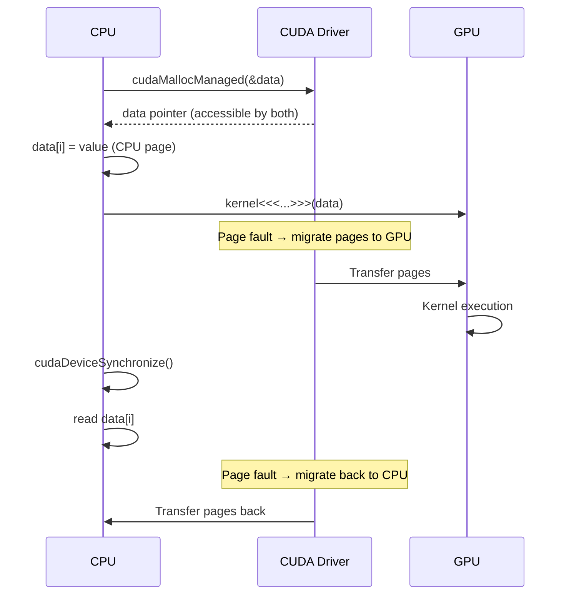
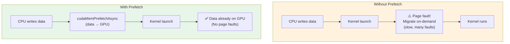
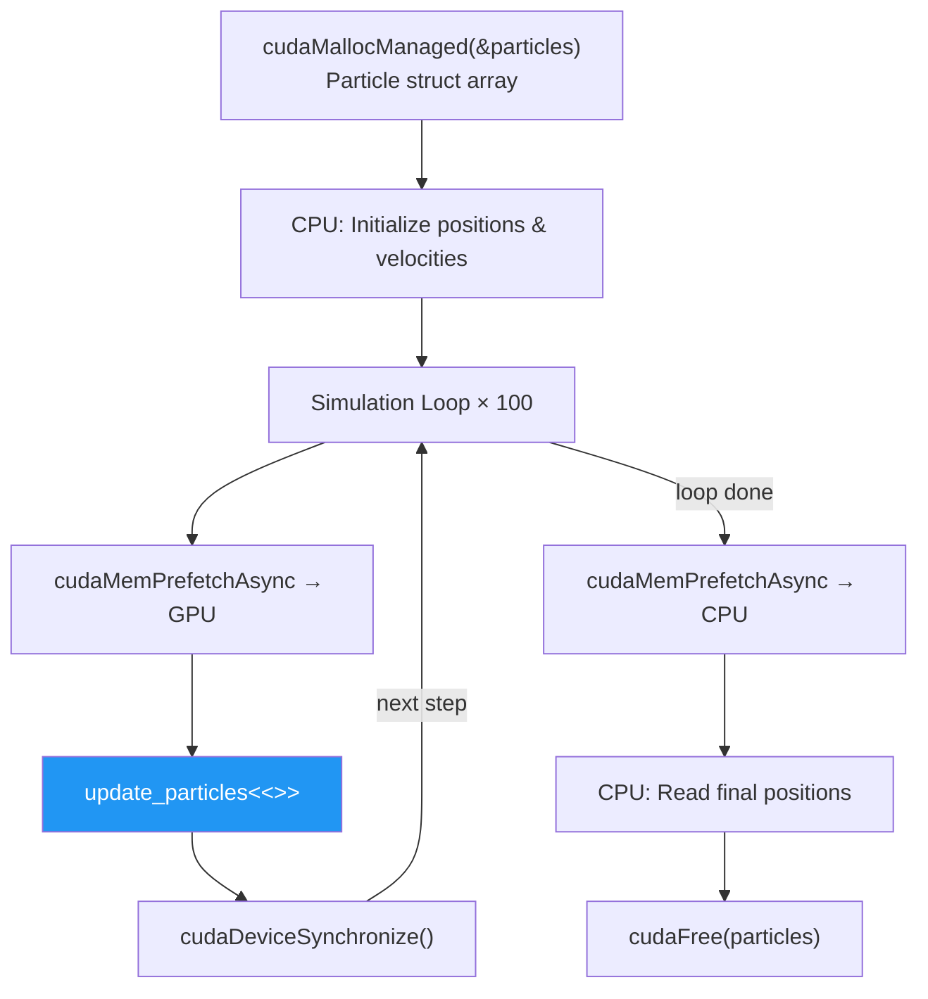
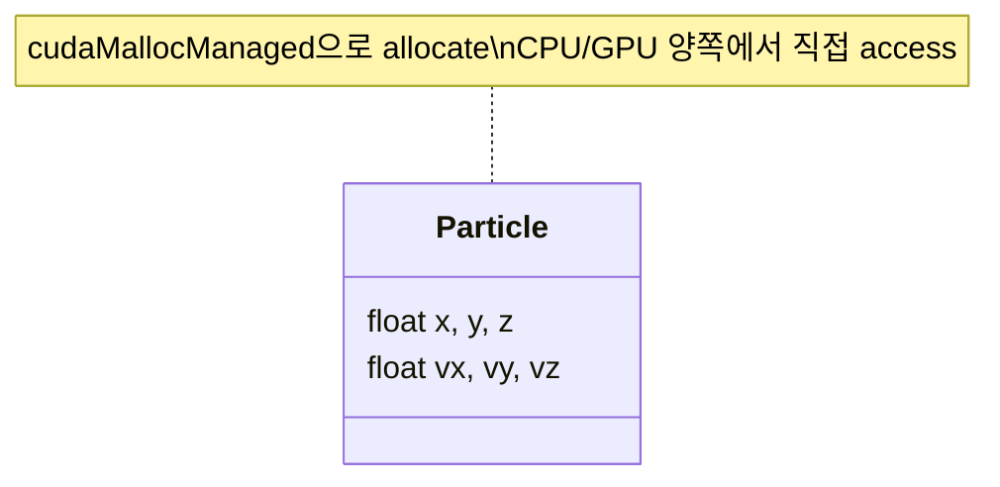

# Lesson 5: Unified Memory

## Manual vs Unified Memory

```mermaid
flowchart TD
    subgraph Manual["Manual Memory Management"]
        M1["malloc(h_data)"] --> M2["cudaMalloc(&d_data)"]
        M2 --> M3["Initialize h_data on CPU"]
        M3 --> M4["cudaMemcpy(d ← h, H→D)"]
        M4 --> M5["kernel<<<...>>>(d_data)"]
        M5 --> M6["cudaMemcpy(h ← d, D→H)"]
        M6 --> M7["Read h_data on CPU"]
        M7 --> M8["free(h) + cudaFree(d)"]
    end

    subgraph Unified["Unified Memory"]
        U1["cudaMallocManaged(&data)"] --> U2["Initialize data on CPU"]
        U2 --> U3["kernel<<<...>>>(data)"]
        U3 --> U4["cudaDeviceSynchronize()"]
        U4 --> U5["Read data on CPU"]
        U5 --> U6["cudaFree(data)"]
    end

    style Manual fill:#ffebee
    style Unified fill:#e8f5e9
```

## Page Migration (Internal)

## Prefetch Optimization

## Particle Simulation Flow

## Unified Memory - Struct Support

> **When to use Unified Memory:**
> - Prototyping / rapid development
> - Complex data structures (linked lists, trees)
> - Data shared frequently between CPU & GPU
>
> **When NOT to use:**
> - Maximum performance needed (manual control better)
> - Predictable access patterns
