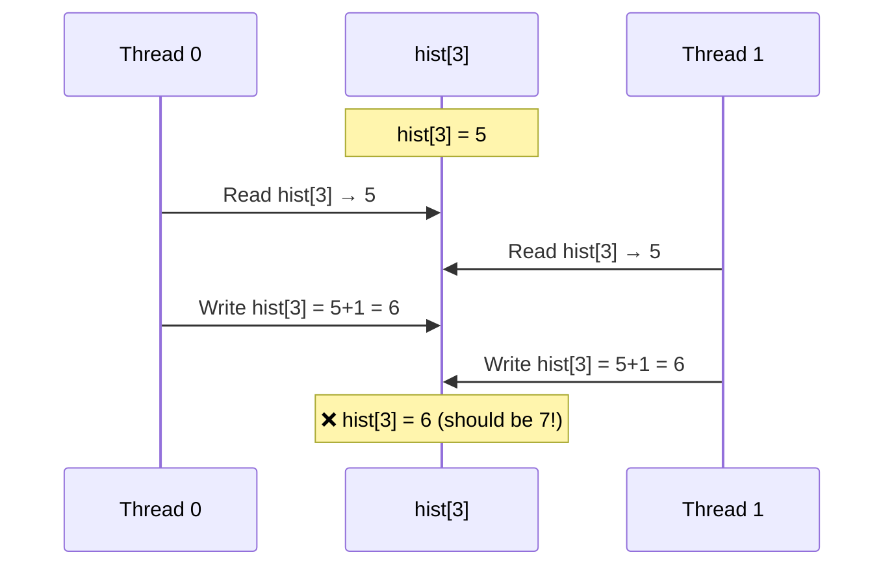
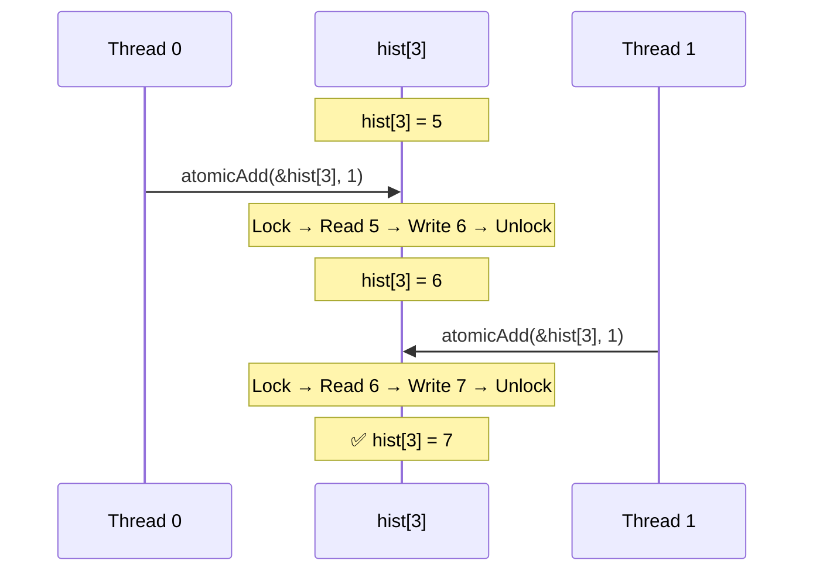
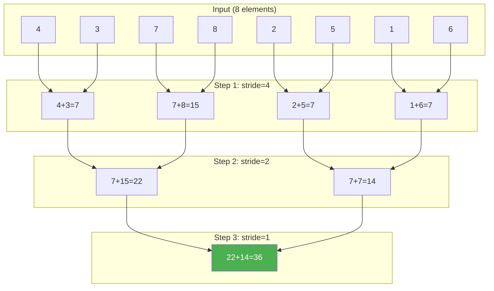
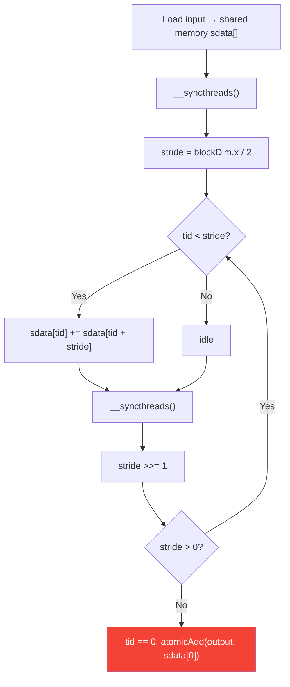
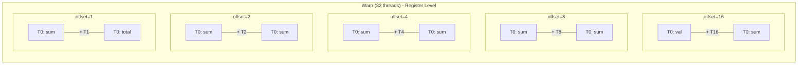

# Lesson 6: Atomic Operations & Parallel Reduction

## Part 1: Race Condition Problem

## Atomic Operation Solution

## Part 2: Tree-Based Parallel Reduction

## Reduction in Shared Memory

## Part 3: Warp Shuffle

> `__shfl_down_sync(mask, val, offset)` — shared memory မလိုဘဲ warp ထဲ data ပေးပို့

## Atomic Functions Reference

| Function | Operation | Example |
|----------|-----------|---------|
| `atomicAdd` | a += b | Histogram, Reduction |
| `atomicSub` | a -= b | Counter decrement |
| `atomicMin` | a = min(a,b) | Find minimum |
| `atomicMax` | a = max(a,b) | Find maximum |
| `atomicCAS` | Compare & Swap | Custom atomic ops |
| `atomicExch` | a = b (atomic) | Lock implementation |
