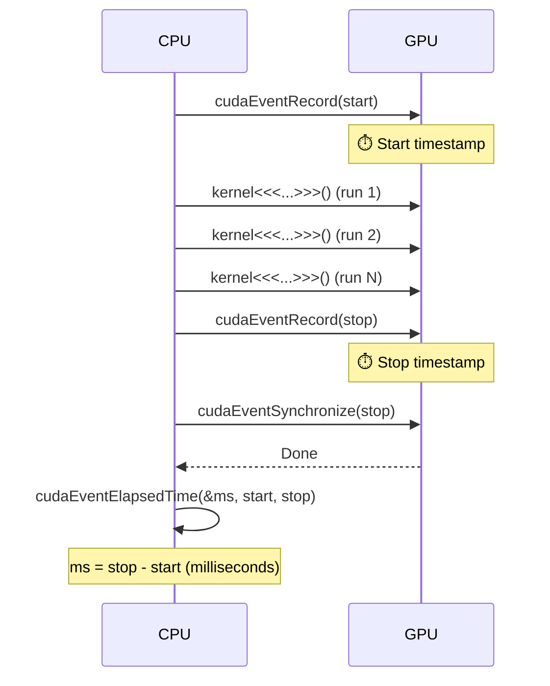
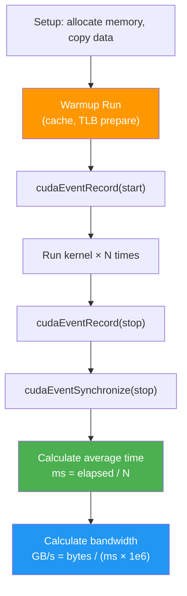
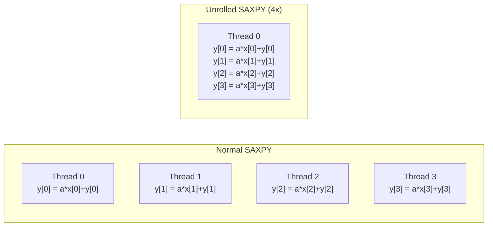
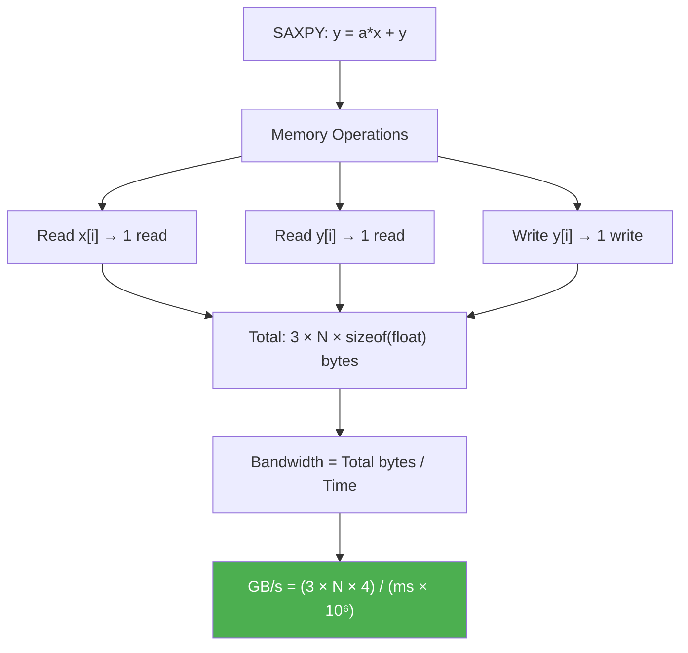
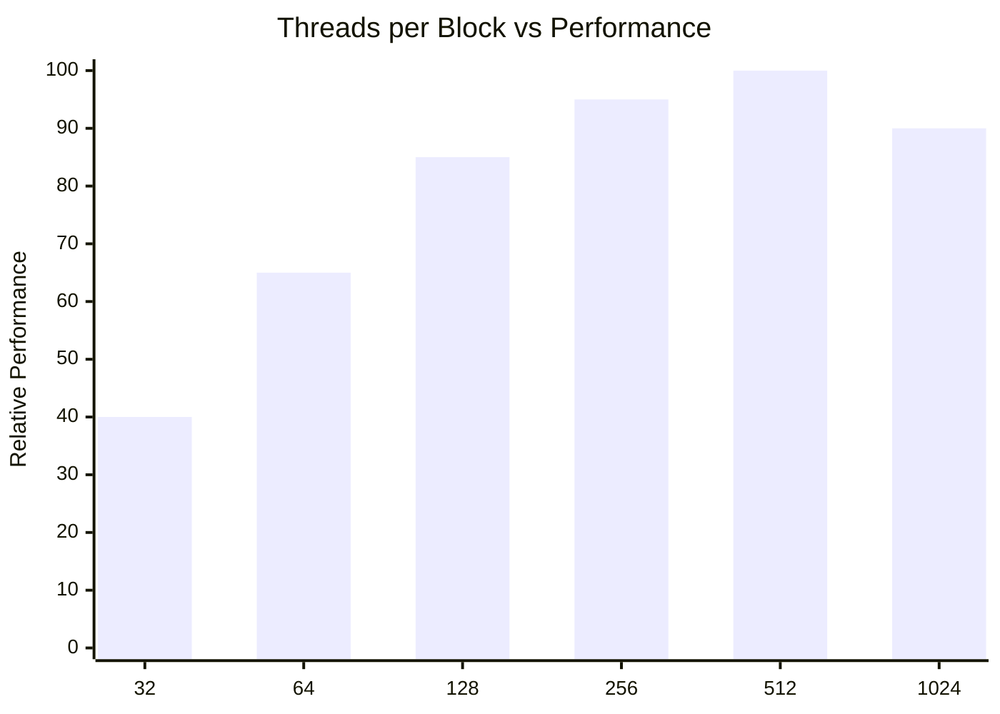
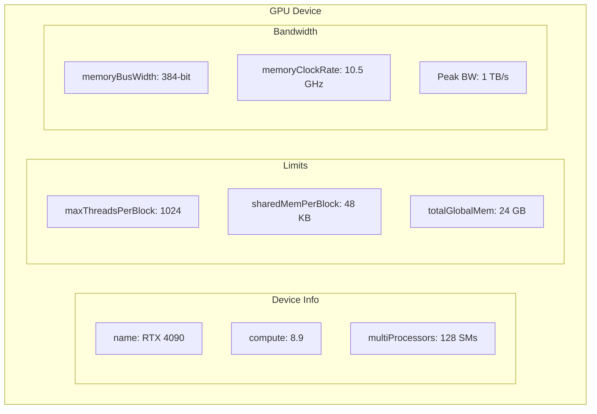

# Lesson 7: CUDA Events & Performance Profiling

## CUDA Event Timing

## Benchmarking Pattern

## SAXPY: y = a*x + y

## Bandwidth Calculation

## Thread Count vs Performance

## Device Properties (cudaGetDeviceProperties)

## Profiling Tools

| Tool | Purpose | Command |
|------|---------|---------|
| **CUDA Events** | Kernel timing | Code ထဲမှာ ရေး |
| **nsys** | Timeline / system view | `nsys profile ./app` |
| **ncu** | Kernel-level analysis | `ncu --set full ./app` |
| **nvprof** | Legacy profiler | `nvprof ./app` |
