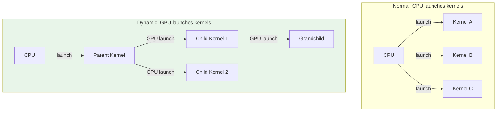
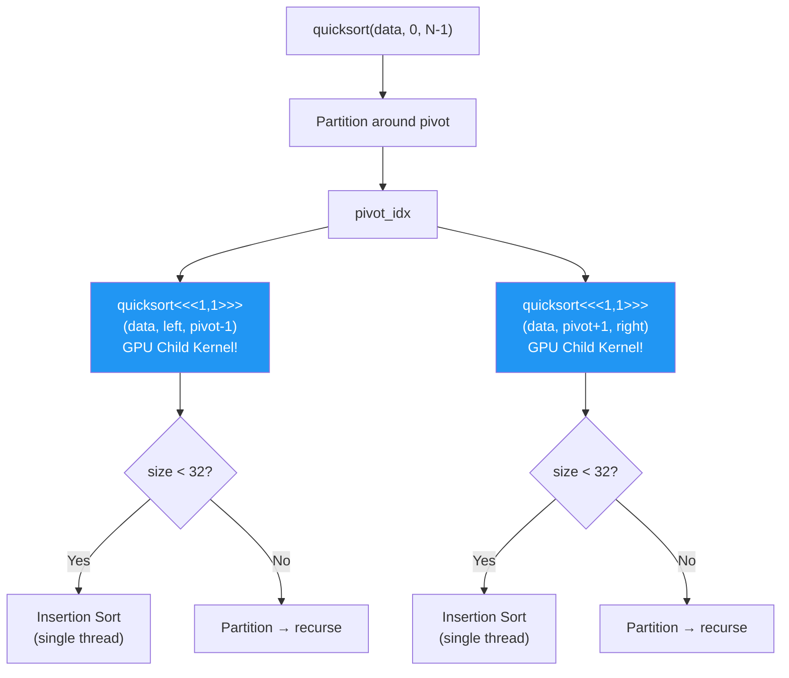
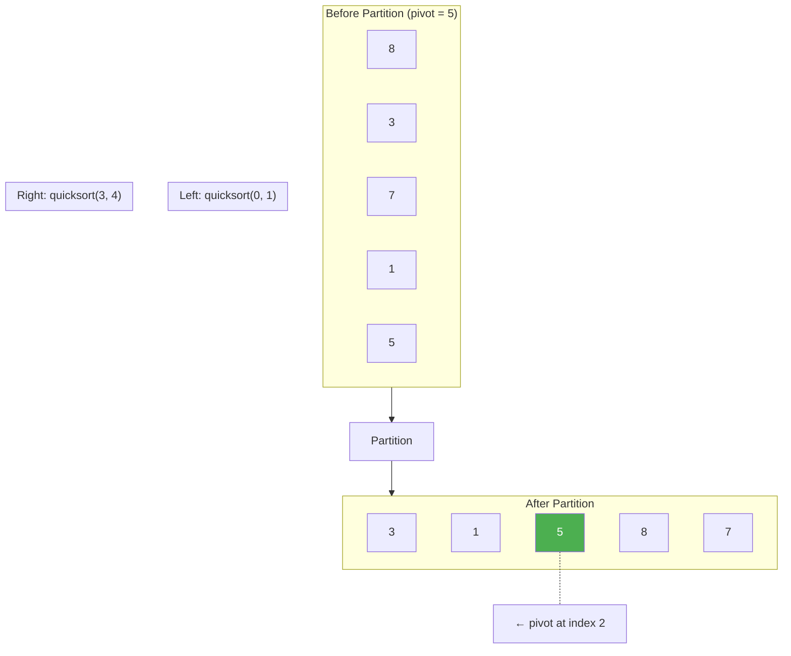
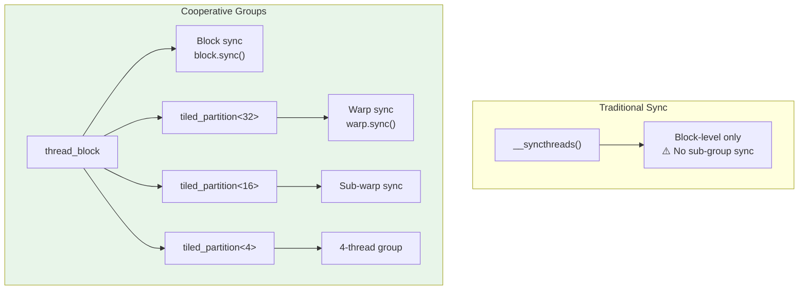
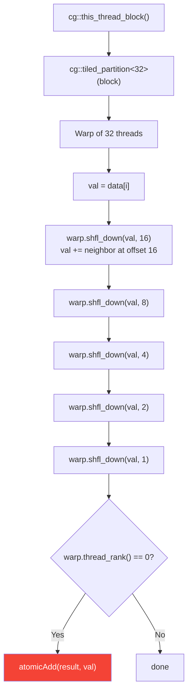
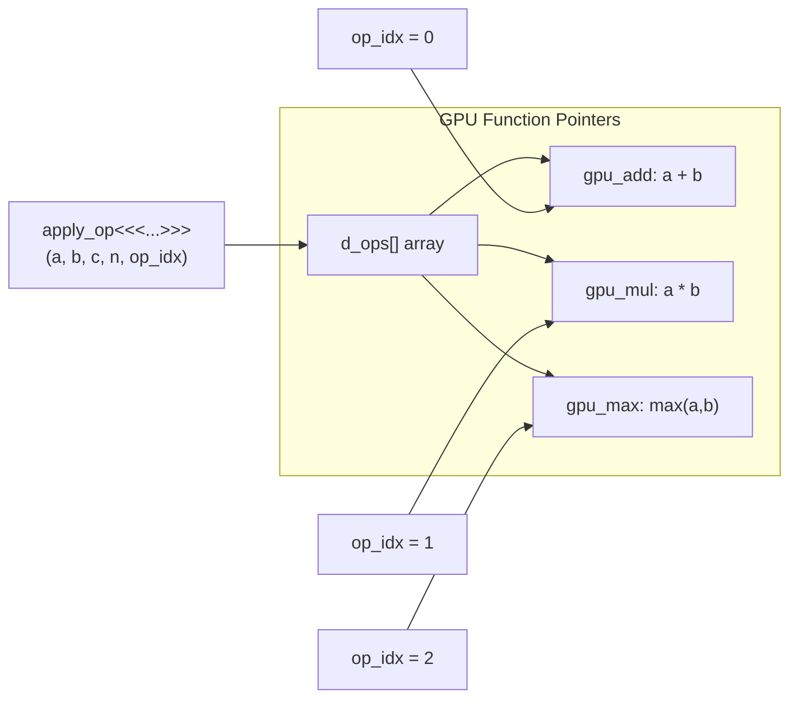
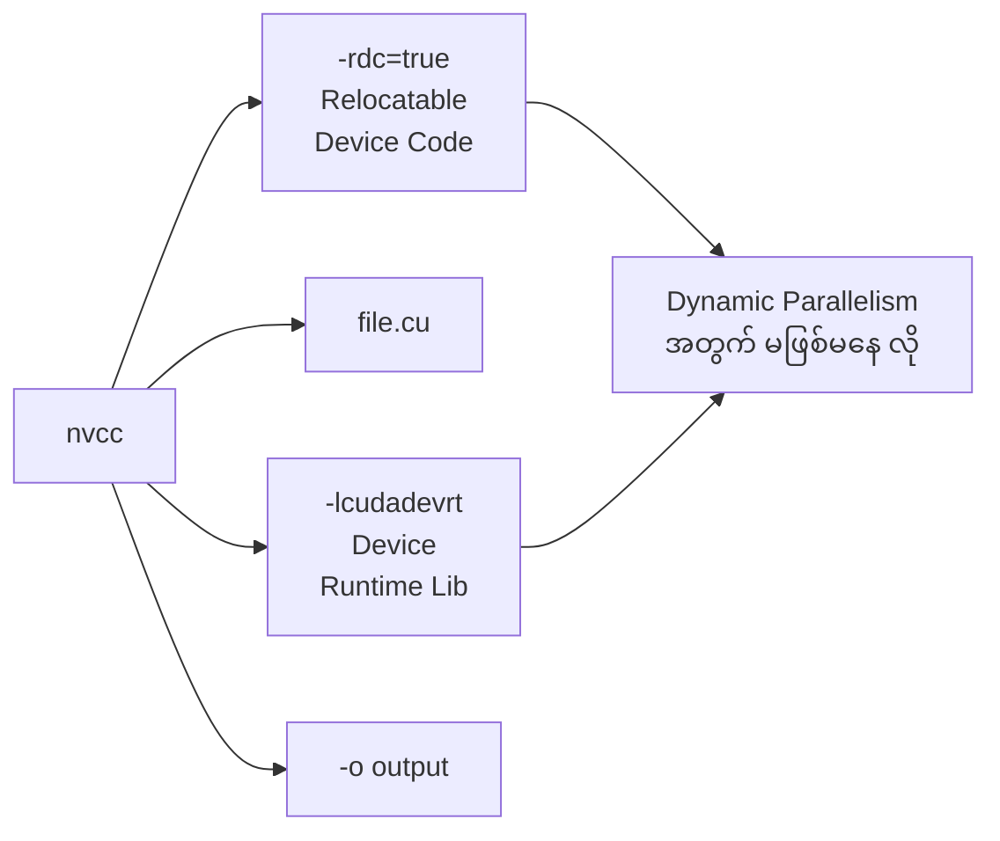

# Lesson 8: Dynamic Parallelism & Advanced Patterns

## Part 1: Dynamic Parallelism

## GPU Quicksort (Recursive)

## Partition Visualization

## Part 2: Cooperative Groups

## Cooperative Groups Reduce

## Part 3: Function Pointers on GPU

## Compile Requirements

## When to Use Dynamic Parallelism

| Use Case | Example |
|----------|---------|
| Recursive algorithms | Quicksort, tree traversal |
| Adaptive computation | AMR (Adaptive Mesh Refinement) |
| Irregular workloads | Graph algorithms |
| Nested parallelism | Fractal generation |

> ⚠️ **သတိ:** Dynamic Parallelism launch overhead ရှိသည်။ Simple cases တွင် CPU launch + streams ပိုမြန်နိုင်သည်။
